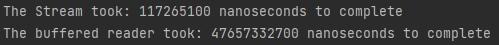
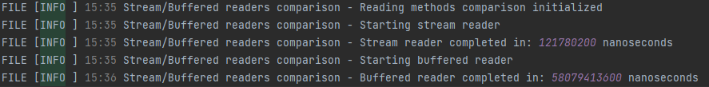
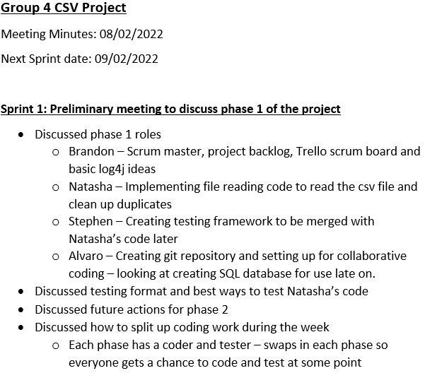
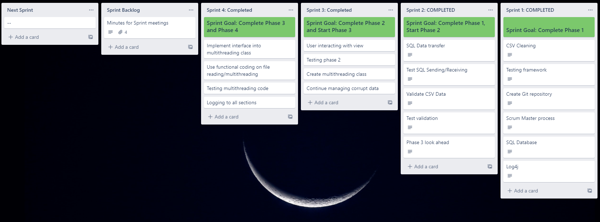

#### Reading with Streams
To improve upon the file reading system, streams were used to read the csv file and remove the duplicate data.
 To enable this method an Employees class was created, containing getters and setters and a toString method.
The stream returned a list of employees and made use of the distinct keyword and a map to split the csv data into 
rows of employees with the duplicate data removed. A separate method was also created to provide a list of duplicate
data if the user required it.
 
The stream improved the file reading speed massively. The image below shows the use of StreamsCompareMain class 
to compare the two methods.
######

######
The stream method was over 400 times quicker to read the data, this is largely because the raw data is only looped through 
once, and only uses one other class (Employees) when ran.
 
Log4j was used to log this comparison to the logfile, below shows the output for this comparison. The logger will also 
warn the user if the try catch block in the Stream method throws an IOException.
######

######

#### Testing SQL Data send and receive
Completing JUnit testing on the SQL 

#### Project Management: Scrum 
A scrum master was nominated for the project and the week split into 4 sprints. Each sprint fit nicely into the 
4 phase format of the project and so in each sprint meeting the next phase was discussed. Each person 
was assigned a responsibility for the phase and progress discussed in the next sprint.
In each sprint, meeting minutes were taken by the scrum master and uploaded into the repository. As an example 
phase 1's minutes are shown below.
######

######
A trello board was also created to keep track of each sprint's backlog, to which the minutes were also uploaded. 
The final board is shown below after the project's completion.
######

######