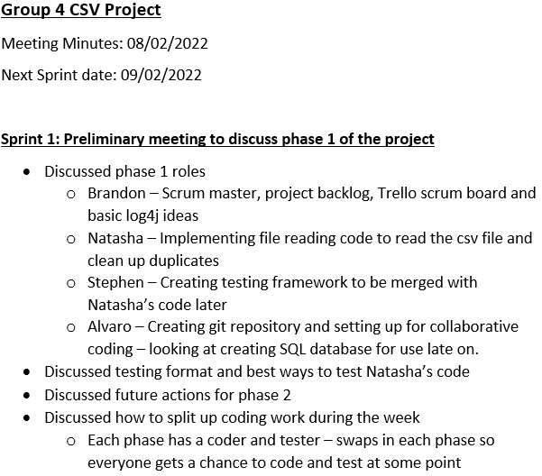

# migrationprojectcsv
 
### Sections
#### Summary
This project will:
- Read data from a CSV file, parse it, populate objects and add to a collection. Moreover, this program must filter the duplicate data from the CSV file. In this scenario, a List populated with arrays of Strings for every record in the CSV file.
- Efficiently write the data from the objects to a relational database using JDBC.
- Expect to demonstrate good programming practices in OOP, SOLID, design patterns (DAO), testing and logging.
#### Pom Dependencies
The dependencies used for this project were:
* org.junit.jupiter:5.8.2 - For testing.
* org.apache.logging.log4j:2.17.1 - For logging.
* mysql:8.0.25 - For database connection and update.
#### SQL Set up / Properties file / Connecting to localhost
To set up the SQL database we followed the Data Access Object ([DAO](https://www.oracle.com/java/technologies/dataaccessobject.html)) design pattern to abstract and encapsulate all access to the data source. This design pattern manages the connection with the data source to obtain and store data. It implements the access mechanism required to work with the data source.

  
*Factory for Data Access Objects Strategy*

In order to have access to the database, we had to create it first. For simplicity, we created it first in MySQL as shown:

```sql
CREATE DATABASE IF NOT EXISTS employeesdb;
USE employeesdb;
```

To allow IntelliJ connecting with MySQL. We had to use the mySQL dependency with all its associated methods:

```xml
<dependency>
    <groupId>mysql</groupId>
    <artifactId>mysql-connector-java</artifactId>
    <version>8.0.25</version>
</dependency>
```

In this project we were using just one factory, so there is only one connection. The *CSVDAOFactory* creates the connection between the IntelliJ and MySQL after passing the information from the *mysql.properties* file:

````properties
dburl=jdbc:mysql://localhost:3306/employeesdb
dbuserid=root
dbpassword=[MYSQL_PASSWORD]
````
<span style="font-size: xx-small; "> *Disclaimer: The information is separated in a different file to avoid information leaks. Be aware always of not sharing this information in public spaces such as GitHub.*</span> 


Once the connection is set, the program will create the *CSVEmployeeDAO* instance that will make possible for having access to the methods that creates and updates the table, and retrieves the data from it.

#### How to use the program
#### Creation phases

This project goes through 4 phases:

* Phase 1 - Initial Reading and Cleaning
    * The program reads the information from a csv file.
    * By reading a file and inserting the data into a list of string arrays. Every element in each array is one of the columns' information in the CSV file. Then, the list is returned.
    * The information is filtered so there are no duplicates. The duplicate data is added to a list for further analysis.

* Phase 2 - Persist to Database
  * The connection between the program and MySQL is properly handled by the script. So, the methods can be called when needed it.
  * The data is migrated into a table after being filtered to its corresponding columns. 
  * The information can be retrieved individually by providing an *Employee ID* or just retrieve all the data.

* Phase 3 - Add Multithreading
  * Using multithreading allows the program to increase its performance substantially by splitting the reading file into different threads.
  * The user can choose how many threads wants to use every time they run the program, so they can compare times between different number of threats.

* Phase 4 - Add Streams and Lambdas
  * To increase performance, there is a second approach to read the CSV file.
  * This reads the file via the *streams* collections, creates an *Employee* instance for every row.
  * By using the method in phase one and *streams*, we can compare the time it takes for each approach to run the code.

#### Performance testing/effect of multithreading/optimal thread number

Multithreading was set up to speed up the reading of the information into the database. This was done by creating a custom object to be threaded(You can find the object names MyThread).
This object took in a start and end position and the list of employees. Then the manager than create an array for the all the threads that need creating and running, and activate them, before waiting for each of them to be complete.

Through testing we found there is an optimal number of threads. Each thread that is added increases the performance up untill a point, then it gets worse again. While this depends on the computer, the
tests we have done on one computer found that 20 threads was optimal, after that the effort in creation and removal of the threads negated the effects of the threads themselves.

Below you can find a number of threads and the seconds that they took:

| Threads | Seconds |
|---------|:-------:|
| 1       |  8.02   |
| 2       |  7.99   |
| 4       |  8.01   |
| 5       |  8.24   |
| 8       |  8.03   |
| 10      |  8.06   |
| 20      |  8.25   |
| 50      |  8.21   |
| 100     |  8.45   |
| 150     |  8.47   |

As expected, there is an optmimum amount of threads, the computer preformed the tasks faster until 20 threads, after which it was slower.
The information is logged with the amount of the threads and the amount it takes.

#### Reading with Streams
To improve upon the file reading system, streams were used to read the csv file and remove the duplicate data.
To enable this method an Employees class was created, containing getters and setters and a toString method.
The stream returned a list of employees and made use of the distinct keyword and a map to split the csv data into
rows of employees with the duplicate data removed. A separate method was also created to provide a list of duplicate
data if the user required it.

The stream improved the file reading speed massively. The image below shows the use of StreamsCompareMain class
to compare the two methods.
######

######
The stream method was over 400 times quicker to read the data, this is largely because the raw data is only looped through
once, and only uses one other class (Employees) when ran.

Log4j was used to log this comparison to the logfile, below shows the output for this comparison. The logger will also
warn the user if the try catch block in the Stream method throws an IOException.
######

######

#### Testing SQL Data send and receive
Completing JUnit testing on the SQL

#### Testing file reader / SQL data transfer / multithreading / functional programming

#### Reading with Streams
To improve upon the file reading system, streams were used to read the csv file and remove the duplicate data.
To enable this method an Employees class was created, containing getters and setters and a toString method.
The stream returned a list of employees and made use of the distinct keyword and a map to split the csv data into
rows of employees with the duplicate data removed. A separate method was also created to provide a list of duplicate
data if the user required it.

The stream improved the file reading speed massively. The image below shows the use of StreamsCompareMain class
to compare the two methods.
######

######
The stream method was over 400 times quicker to read the data, this is largely because the raw data is only looped through
once, and only uses one other class (Employees) when ran.

Log4j was used to log this comparison to the logfile, below shows the output for this comparison. The logger will also
warn the user if the try catch block in the Stream method throws an IOException.
######

######


#### Testing SQL Data send and receive
Completing JUnit testing on the SQL

#### Project Management: Scrum
A scrum master was nominated for the project and the week split into 4 sprints. Each sprint fit nicely into the
4 phase format of the project and so in each sprint meeting the next phase was discussed. Each person
was assigned a responsibility for the phase and progress discussed in the next sprint.
In each sprint, meeting minutes were taken by the scrum master and uploaded into the repository. As an example
phase 1's minutes are shown below.
######

######
A trello board was also created to keep track of each sprint's backlog, to which the minutes were also uploaded.
The final board is shown below after the project's completion.
######

######

#### Logging with Log4j
To check if everything is working accordingly to the expected results. We can log the actions of the program; throwing possible *warning* and *errors* that the program might not handle properly.

To reduce the image size, multiple *Database connection created* logs have been removed from it.


